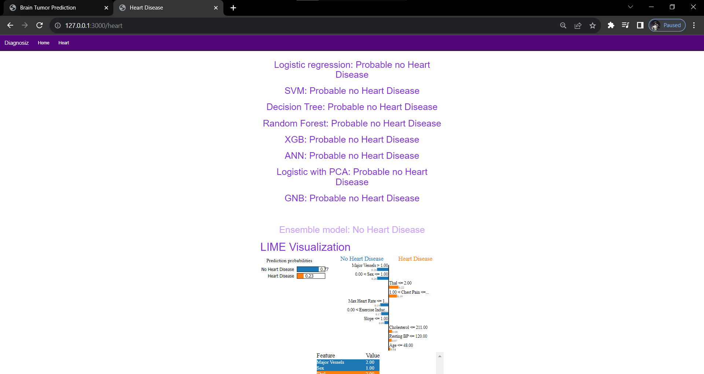

# Heart Disease Prediction and Explainable AI with LIME

## Overview
The Heart Disease Prediction and Explainable AI project is a web-based application built with Flask that predicts the likelihood of heart disease based on user-provided health parameters. It utilizes multiple machine learning models for prediction, including Logistic Regression, Support Vector Machine (SVM), Decision Tree, Random Forest, XGBoost (XGB), and an Artificial Neural Network (ANN). Additionally, the project employs LIME (Local Interpretable Model-Agnostic Explanations) to provide explanations for model predictions, enhancing transparency and understanding.

## Sample screenshots

## Features
- Predicts the presence of heart disease based on user input, including age, gender, chest pain type, blood pressure, cholesterol levels, sugar levels, ECG results, heart rate, exercise-induced angina, oldpeak, slope, number of major vessels, and thalassemia.
- Utilizes multiple machine learning models for prediction, allowing users to see predictions from different models.
- Offers an ensemble model prediction that combines individual model predictions.
- Employs LIME to provide local interpretability for model predictions.

## Usage
1. Input your health parameters in the web application.
2. The application will predict the likelihood of heart disease based on various machine learning models and display the results.
3. You can explore explanations for the predictions provided by LIME.

## Models and Explainability
- The project uses the following machine learning models: Logistic Regression, SVM, Decision Tree, Random Forest, XGBoost, and an ANN.
- LIME is employed to provide local interpretability for model predictions, explaining the decision-making process.

## Explainability with LIME
LIME provides local and interpretable explanations for model predictions, enhancing transparency and aiding in understanding why a particular prediction was made. This feature offers valuable insights into the prediction process.

